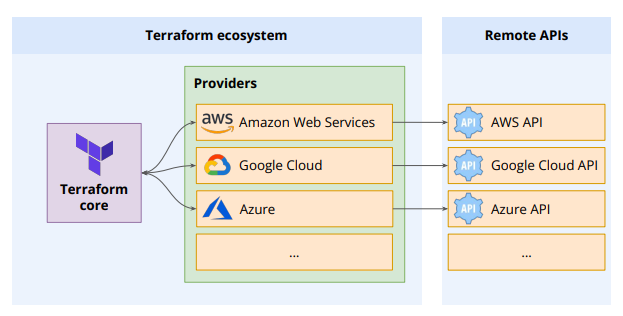
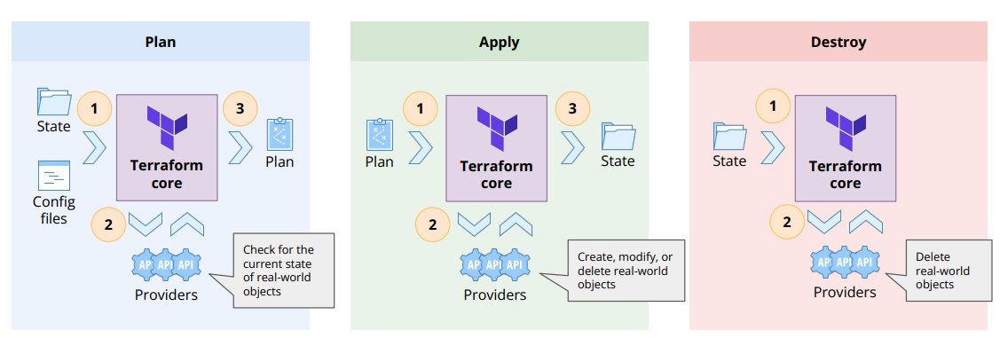

# Terraform

## Whyy terrorform over other IaC tools?

- **Platform Agnostic**: Works with multiple cloud providers (AWS, Azure, GCP, etc.) and on-premises solutions.
- **Higher abstraction**
- **Modular approach**
- **Parallel deployment**
- **Seperation of plan and apply**: Terraform allows you to create an execution plan before applying changes, enabling you to review and approve changes before they are made.

## Architecture

 

- **Provider**: A plugin that allows Terraform to interact with a specific cloud provider or service. Providers are responsible for understanding API interactions and exposing resources.

## Stages of Terraform

## Basic Commands

### terraform init

- **Download providers**
- **Initialize backend**
- **Initialize modules**
- **Create .terraform directory**

### terraform plan

- **Create an execution plan**
- **Does not make any changes to real resources**

### terraform apply

- **Apply the changes required to reach the desired state**
- **Creates, updates, or deletes resources**

### terraform destroy

- **Destroy the managed infrastructure**
