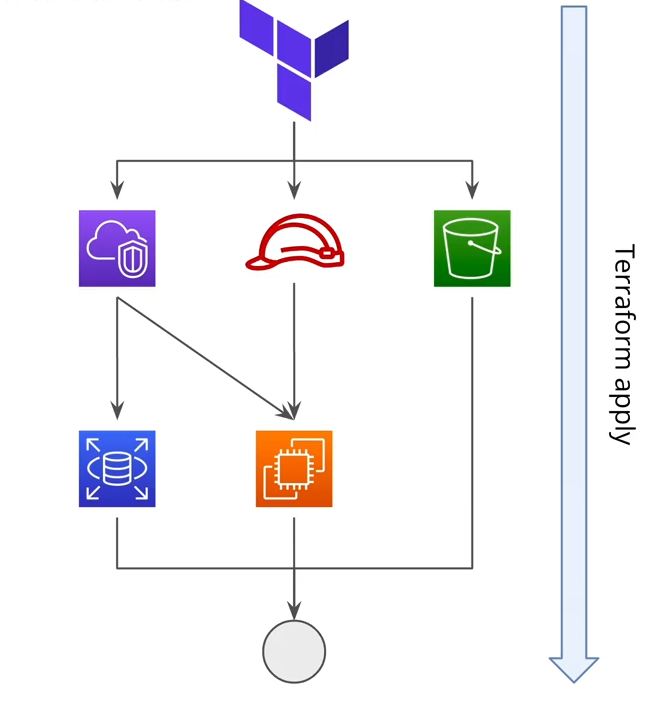

# Resources Block

- Use to create resources using Terraform
- Most important block in Terraform
- If no provider is specified, Terraform will use the default provider
- use for_each and count to create multiple resources

## Resource dependencies

- Implicit dependencies: Terraform automatically infers dependencies between resources based on references in the configuration.
- Explicit dependencies: Use the `depends_on` argument to specify dependencies that are not automatically inferred
- Support both parallel and sequential resource creation based on dependencies

## Meta-arguments

- `count`: Create multiple instances of a resource
- `for_each`: Iterate over a map or set to create multiple instances of a resource
- `depends_on`: Specify explicit dependencies between resources
- `provider`: Specify which provider to use for a resource
- `create_before_destroy`: Used in resource lifecycle to create a new resource before destroying the old one (Terraforms default behavior is to destroy first then create)
- `prevent_destroy`: Used in resource lifecycle to prevent a resource from being destroyed (terraform will throw an error if you try to destroy the resource)
- `replace_triggered_by`: Replace a resource when a specific item changes (e.g., a specific attribute of another resource)
- `ignore_changes`: Ignore changes to specific attributes of a resource during updates (useful for attributes managed outside of Terraform)
