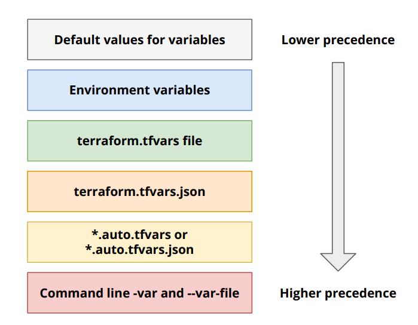

# Input variables

Input variables allow you to customize the behavior of your Terraform modules without changing the module's code.

## Variable Precedence



- If there were no default value defined for a variable, Terraform will prompt the user to provide a value for the variable when running `terraform apply` or `terraform plan`.
- We can add validation rules to input variables to ensure that the provided values meet certain criteria.

🆚 Object vs. Map in Terraform

Terraform has two structured data types:

- `object({...})` → strict, typed structure
- `map(type)` → flexible key-value map

Below is a breakdown:

🔷 1. OBJECT — strongly typed structured data

- Fixed set of attributes
- Each attribute has a defined type
- Terraform validates structure at plan/apply time

Example:

```hcl
variable "user" {
    type = object({
        name  = string
        email = string
        age   = number
    })
}
```

If you pass:

```hcl
user = {
    name  = "John"
    email = "john@x.com"
    age   = "25" # ❌ wrong type → Terraform will fail
}
```

Or if you add extra fields:

```hcl
user = {
    name  = "John"
    email = "john@x.com"
    age   = 25
    phone = "123" # ❌ unknown attribute
}
```

Terraform errors out because the structure is strict.

When to use object:

- You know the structure
- You want validation
- You want schema-like enforcement
- For module inputs (good practice)

🔶 2. MAP — dynamic key-value structure

- Keys are dynamic (not predefined)
- All values must be of the same type
- Less strict than object

Example:

```hcl
variable "tags" {
    type = map(string)
}
```

You can pass anything:

```hcl
tags = {
    env   = "prod"
    owner = "kavindu"
    team  = "devops"
}
```

Keys can change as long as values are strings.

When to use map:

- Tags
- Labels
- Arbitrary configuration
- Input where keys change often
- Flexible dictionaries

## env variables

- You can set input variable values using environment variables.

- The environment variable name must be in the format `TF_VAR_<variable_name>`.

- Terraform automatically picks up these environment variables when running commands.

- This has higher precedence than default values but lower than `terraform.tfvars` , `.auto.tfvars`, and CLI `-var` options.

Example:

```bash
export TF_VAR_instance_type="t2.micro"
export TF_VAR_project_name="MyProject"
```

## .tfvars files

- A .tfvars file is where you store variable values for Terraform.
- Instead of passing variables via CLI (-var) or environment variables, you put them neatly into a file.

variables.tf

```terraform
variable "instance_type" {
  type = string
}

variable "project_name" {
  type = string
}
```

dev.tfvars

```terraform
instance_type = "t2.micro"
project_name  = "DevProject"
```

prod.tfvars

```terraform
instance_type = "m5.large"
project_name  = "ProdProject"
```

terraform.tfvars automatically loads if present.

You can create multiple .tfvars files for different environments (e.g., dev.tfvars, prod.tfvars). But they won't load automatically; you have to specify which one to use.

To use a .tfvars file, run:

```bash
terraform apply -var-file="dev.tfvars"
```

## .auto.tfvars files

- Files ending with `.auto.tfvars` are automatically loaded by Terraform.
- You don't need to specify them with `-var-file`; Terraform picks them up automatically.

- Also .auto.tfvars files have higher precedence than terraform.tfvars.

## CLI -var and -var-file options

- You can pass variable values directly via the command line using the `-var` option.
  Example:

```bash
terraform apply -var="instance_type=t2.micro" -var="project_name=MyProject"
```

- You can also specify a variable file using the `-var-file` option.
  Example:

```bash
terraform apply -var-file="custom.tfvars"
```

- CLI options have the highest precedence, overriding all other methods of setting variable values.

## Locals

- Locals are named values that you can define within a module to simplify expressions and avoid repetition.

- They are defined using the `locals` block and can be referenced throughout the module.

Example:

```hcl
locals {
  region_prefix = "us-west-"
  full_region   = "${local.region_prefix}2"
}
```
