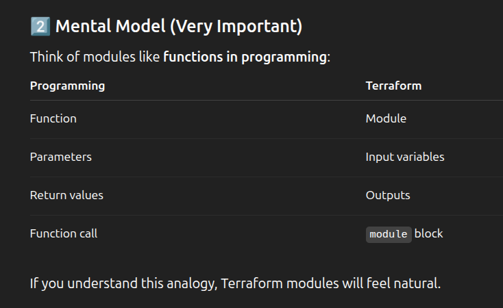
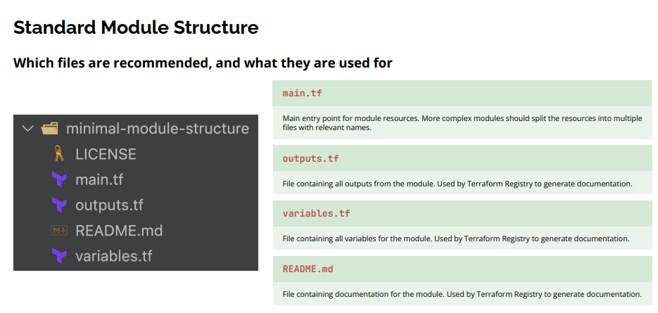
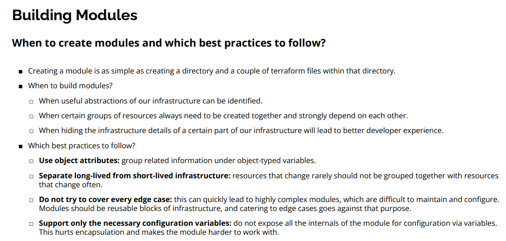
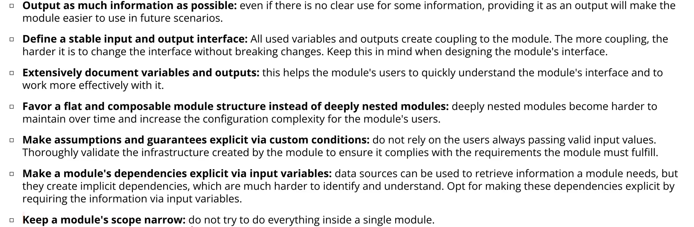

# Modules


- Every Terraform project is already a module.
- The folder where you run terraform init is called the root module
- Any other folder you call from it is a child module





## Create own module





## Publish Module


## 2️⃣ Why Modules Exist (Problem → Solution)

### ❌ Without modules

You copy-paste EC2, VPC, IAM code everywhere
- → Hard to maintain
- → Error-prone
- → Large messy files

### ✅ With modules

- Reusable
- Clean
- Parameterized using variables
- Outputs can be shared between modules

## 3️⃣ Types of Terraform Modules

### 1. Root module

The folder where you run:

```bash
terraform init
terraform plan
terraform apply
```

👉 Every Terraform project has one root module

### 2. Child modules

Folders that are called by the root module

## 4️⃣ Typical Terraform Project Structure

```plaintext
terraform-project/
│
├── main.tf ← root module
├── variables.tf
├── outputs.tf
│
└── modules/
    └── ec2/
        ├── main.tf
        ├── variables.tf
        └── outputs.tf
```

📌 modules/ec2/ is a child module

## 5️⃣ Simple Example: EC2 Module

### 🎯 Goal

- Create EC2 inside a module
- Pass values from root → module
- Get outputs from module → root

## 6️⃣ Child Module Code (modules/ec2/)

### 📄 modules/ec2/variables.tf

Variables = inputs to the module

```hcl
variable "instance_type" {
  description = "Type of EC2 instance"
  type        = string
}

variable "ami_id" {
  description = "AMI ID for EC2"
  type        = string
}
```

### 🧠 Explanation

- variable → input parameter
- type = string → must be text
- This is like function arguments

### 📄 modules/ec2/main.tf

```hcl
resource "aws_instance" "this" {
  ami           = var.ami_id
  instance_type = var.instance_type
}
```

### 🧠 Explanation

- var.ami_id → value passed from root
- aws_instance.this → EC2 resource

### 📄 modules/ec2/outputs.tf

Outputs = return values of module

```hcl
output "instance_id" {
  value = aws_instance.this.id
}
```

### 🧠 Explanation

- Exposes EC2 ID to whoever uses this module
- Similar to return in a function

## 7️⃣ Root Module (Calling the Module)

### 📄 main.tf (root module)

```hcl
module "my_ec2" {
  source = "./modules/ec2"

  instance_type = "t3.micro"
  ami_id        = "ami-0abcdef1234567890"
}
```

### 🧠 Explanation

- module "my_ec2" → creates a module instance
- source → path to module
- Values are passed to variables

📌 This is like:

```javascript
createEC2("t3.micro", "ami-xxx")
```

## 8️⃣ How Variables Flow (Very Important)

```plaintext
Root module
↓
module "my_ec2"
↓
variables.tf (child)
↓
main.tf (child)
```

**Rule**

👉 Root passes → Child receives via `var.`

## 9️⃣ Accessing Module Outputs (Return Values)

### 📄 Root outputs.tf

```hcl
output "ec2_id_from_module" {
    value = module.my_ec2.instance_id
}
```

### 🧠 Explanation

- module.my_ec2 → module reference
- .instance_id → output name from child module

📌 Output chain:

```plaintext
aws_instance.this.id
↓
output "instance_id"
↓
module.my_ec2.instance_id
```
