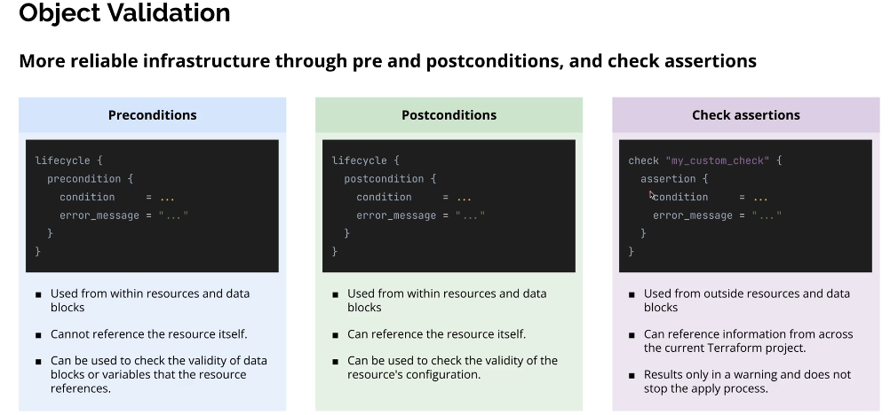
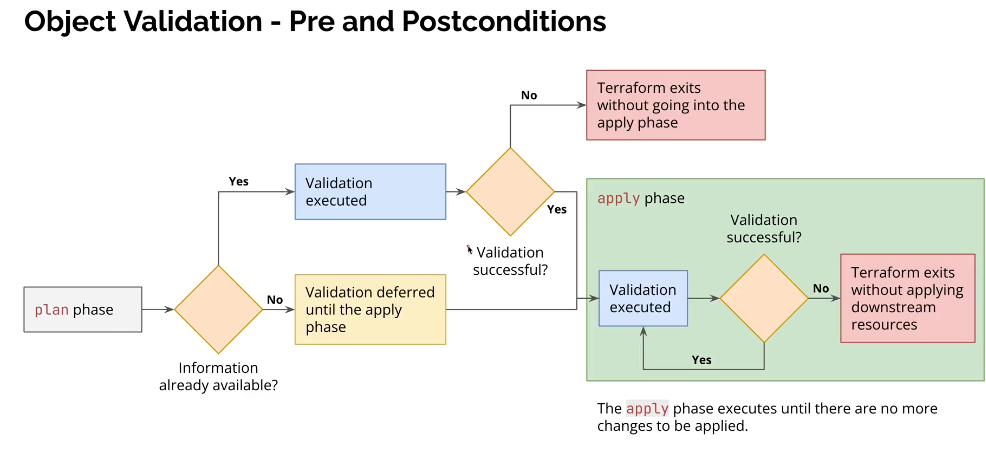

# Object Validation





- Some validation may happen in plan. Values that are not known in the plan phase cannot be validated until apply.
- So if validation get passed in plan phase, it may still fail in apply phase.

## 1️⃣ Big picture (mental model)

Terraform has 3 layers of “truth checking”:

| Mechanism        | Purpose                                      | Stops apply?         |
| :--------------- | :------------------------------------------- | :------------------- |
| Preconditions    | “Are inputs valid before creating/updating?” | ✅ Yes               |
| Postconditions   | “Did the resource end up correctly?”         | ✅ Yes               |
| Check assertions | “Is something true across the project?”      | ❌ No (warning only) |

Think of them like:

- **Precondition** → input validation
- **Postcondition** → output/result validation
- **Check** → monitoring / guardrails

## 2️⃣ Preconditions

### What is a precondition?

A precondition is a rule that must be true before Terraform creates or updates a resource or data source.

- If the condition is false → Terraform fails immediately.

### Where it lives

Inside a resource or data block, under `lifecycle`.

### Basic syntax

```hcl
resource "aws_instance" "example" {

  # resource config...

  lifecycle {
    precondition {
      condition     = ...
      error_message = "..."
    }
  }
}
```

### New terms explained

- **lifecycle** → Controls how Terraform manages a resource
- **precondition** → A rule checked before apply
- **condition** → Must evaluate to true
- **error_message** → Shown if condition is false

### Example 1: Validate variable before resource creation

```hcl
resource "aws_instance" "example" {
  instance_type = var.instance_type
  ami           = var.ami

  lifecycle {
    precondition {
      condition     = contains(["t3.micro", "t3.small"], var.instance_type)
      error_message = "Only t3.micro or t3.small are allowed."
    }
  }
}
```

### What happens

- Terraform evaluates condition
- If `instance_type = "m5.large"` → ❌ apply stops
- No AWS API call is made

### ⚠️ Important rule

Preconditions cannot reference the resource itself

This is invalid:

```hcl
condition = aws_instance.example.instance_type == "t3.micro" ❌
```

### Example 2: Validate data source input

```hcl
data "aws_subnet" "selected" {
  id = var.subnet_id

  lifecycle {
    precondition {
      condition     = var.subnet_id != ""
      error_message = "subnet_id must not be empty."
    }
  }
}
```

### When to use Preconditions

- ✅ Validate inputs
- ✅ Enforce business rules
- ❌ Do not inspect resource results

## 3️⃣ Postconditions

- 🛑 Postconditions are evaluated after the resource is created or refreshed
- 🛑 They can also run during terraform plan only if the value is already known

### What is a postcondition?

A postcondition is checked after Terraform creates or reads a resource.

It answers:

“Did this resource end up in a valid state?”

- If false → apply fails, even though the resource already exists.

### Syntax

```hcl
resource "aws_instance" "example" {

  # resource config...

  lifecycle {
    postcondition {
      condition     = ...
      error_message = "..."
    }
  }
}
```

### Key difference vs precondition

| Feature                | Precondition     | Postcondition     |
| :--------------------- | :--------------- | :---------------- |
| Runs                   | Before apply     | After apply       |
| Can reference resource | ❌ No            | ✅ Yes            |
| Use case               | Input validation | Result validation |

### Example 1: Ensure instance is in correct AZ

```hcl
resource "aws_instance" "example" {
  ami           = var.ami
  instance_type = "t3.micro"
  subnet_id     = var.subnet_id

  lifecycle {
    postcondition {
      condition     = self.availability_zone == "us-east-1a"
      error_message = "Instance must be in us-east-1a."
    }
  }
}
```

### New term

- **self** → Refers to this resource instance

### Example 2: Ensure encryption is enabled

```hcl
resource "aws_ebs_volume" "data" {
  availability_zone = "us-east-1a"
  size              = 50
  encrypted         = true

  lifecycle {
    postcondition {
      condition     = self.encrypted == true
      error_message = "EBS volumes must be encrypted."
    }
  }
}
```

### Important warning ⚠️

If a postcondition fails:

- The resource already exists
- Terraform reports failure
- You must fix config and re-apply

### When to use Postconditions

- ✅ Validate provider behavior
- ✅ Enforce security guarantees
- ❌ Don’t use for basic input validation

## 4️⃣ Check assertions

### What is a check block?

A check assertion is a global validation rule that:

- Runs during plan/apply
- Can reference anything
- Produces warnings only
- Does NOT stop apply

Think of it as policy hints, not hard rules.

### Syntax

```hcl
check "my_custom_check" {
  assertion {
    condition     = ...
    error_message = "..."
  }
}
```

### Example 1: Warn if using default VPC

```hcl
check "no_default_vpc" {
  assertion {
    condition     = var.use_default_vpc == false
    error_message = "Using default VPC is discouraged."
  }
}
```

### Result

Warning: Using default VPC is discouraged.

Apply continues.

### Example 2: Cross-resource validation

```hcl
check "prod_instance_size" {
  assertion {
    condition = !(
      var.environment == "prod" &&
      var.instance_type == "t3.micro"
    )
    error_message = "Production should not use t3.micro."
  }
}
```

- ✔ This cannot be done with pre/postconditions easily.

### When to use Check assertions

- ✅ Best-practice warnings
- ✅ Policy guidance
- ✅ Cross-module checks
- ❌ Never for hard safety rules

## 5️⃣ Choosing the right one (exam-ready table)

| Scenario                  | Use           |
| :------------------------ | :------------ |
| Validate variable value   | Precondition  |
| Ensure encryption enabled | Postcondition |
| Warn about bad practice   | Check         |
| Cross-resource rule       | Check         |
| Stop apply on violation   | Pre/Post      |
| Only warn                 | Check         |
