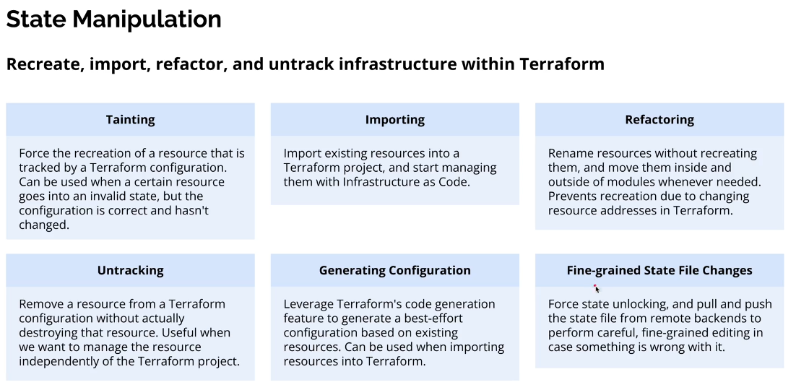

# State Manipulation



## 🌍 First: What is Terraform State? (Very important)

Terraform state is a file (terraform.tfstate) that answers one question:

**“What real infrastructure exists right now, and which Terraform resource owns it?”**

It stores:
*   Resource IDs (EC2 ID, subnet ID, etc.)
*   Dependencies
*   Metadata Terraform needs to calculate changes

> ⚠️ **State ≠ Code**
> *   .tf files → desired configuration
> *   terraform.tfstate → reality mapping

## 1️⃣ Tainting (Force Recreation)

### Slide meaning
Force Terraform to destroy and recreate a resource even if the config didn’t change.

### When to use
*   Resource is broken / corrupted
*   Cloud provider bug
*   Manual change caused weird behavior
*   You want a fresh rebuild

### Command
```sh
terraform taint aws_instance.web
```

### 📌 What this does
*   Marks the resource as “tainted” in state
*   On next terraform apply, Terraform:
    *   Destroys it
    *   Recreates it

### Example
```hcl
resource "aws_instance" "web" {
  ami           = "ami-123"
  instance_type = "t3.micro"
}
```
Even if nothing changed, taint forces recreation.

### 🧠 Think of taint as:
> “This thing exists, but I don’t trust it — rebuild it.”

## 2️⃣ Importing (Bring Existing Infra Under Terraform)

### Slide meaning
Take already-existing infrastructure and start managing it with Terraform.

### When to use
*   Resource created manually
*   Resource created by another tool
*   Migrating old infrastructure to IaC

### Step-by-step process

#### Step 1: Write empty resource block
```hcl
resource "aws_instance" "web" {}
```
(Terraform needs an address to attach the real resource)

#### Step 2: Import
```sh
terraform import aws_instance.web i-0abc12345
```
*   `aws_instance.web` → Terraform address
*   `i-0abc12345` → real cloud resource ID

#### Step 3: Fill configuration

Run:
```sh
terraform plan
```
Terraform will tell you what config is missing.

### 🧠 Mental model:
> “Terraform, this thing already exists — please track it.”

## 3️⃣ Refactoring (Rename / Move Without Recreate)

### Slide meaning
Change Terraform structure without destroying real infrastructure.

### Very common refactors
*   Rename resources
*   Move resources into modules
*   Split monolithic configs

### Problem without refactoring
Terraform thinks:
> “Old resource deleted + new resource created”

💥 **Result:** unwanted destruction

### Solution: `terraform state mv`

#### Rename a resource
```sh
terraform state mv aws_instance.old aws_instance.new
```

#### Move into module
```sh
terraform state mv aws_instance.web module.ec2.aws_instance.web
```

📌 **This updates state only, not real infra.**

### 🧠 Mental model:
> “Same thing, new address.”

## 4️⃣ Untracking (Stop Managing, Don’t Destroy)

### Slide meaning
Remove a resource from Terraform without deleting it.

### When to use
*   Resource should exist but not be managed by Terraform
*   Migrating responsibility
*   Temporary exclusion

### Command
```sh
terraform state rm aws_instance.web
```

### 📌 What happens
*   Resource stays alive in AWS
*   Terraform forgets it

### ⚠️ Important
If the resource block still exists in .tf, Terraform will try to recreate it.

👉 **Usually you:**
1.  Remove resource block
2.  Run `terraform state rm`

### 🧠 Mental model:
> “This exists, but it’s no longer my job.”

## 5️⃣ Generating Configuration (Reverse Engineering)

### Slide meaning
Generate Terraform code from existing infrastructure

### Tool
*   `terraform import`
*   `terraform plan`

Some providers support:
```sh
terraform show
```
Terraform tries best-effort config generation.

### ⚠️ Limitations
*   Not perfect
*   Manual cleanup required
*   Good starting point, not final code

### 🧠 Mental model:
> “Show me what code might recreate this.”

## 6️⃣ Fine-grained State File Changes (Danger Zone ⚠️)

### Slide meaning
Manually manipulate state when things go very wrong

### Common commands

#### Force unlock state
```sh
terraform force-unlock LOCK_ID
```
Used when:
*   Terraform crashed
*   Lock wasn’t released

#### Pull state
```sh
terraform state pull > backup.tfstate
```
📌 Downloads remote state locally

#### Push state
```sh
terraform state push fixed.tfstate
```
📌 Upload edited state

### ⚠️ Editing state manually is risky
*   Always backup
*   Only when you deeply understand the structure

### 🧠 Mental model:
> “Direct brain surgery on Terraform’s memory.”

## 🧠 Big Picture Summary (Slide → Reality)

| Slide Concept | What It Really Means |
| :--- | :--- |
| Tainting | Force rebuild |
| Importing | Adopt existing infra |
| Refactoring | Change structure safely |
| Untracking | Stop managing |
| Generating config | Reverse engineer |
| Fine-grained changes | Emergency repair |
